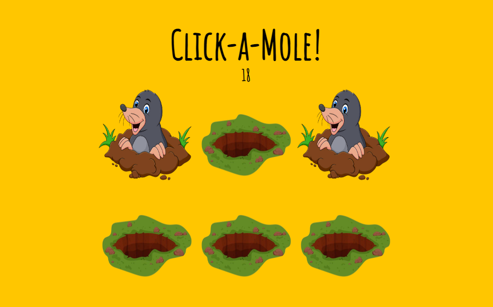

<h1 align="center">Click a Mole</h1>


<div align="center">
  <h3>
    <a href="https://smtoyedeji.github.io/click-a-mole/" target="_blank">
      Live Website
    </a>
    <span> | </span>
    <a href="https://github.com/smtoyedeji/click-a-mole.git">
      Github Repo
    </a>
  </h3>
</div>

## Table of Contents

- [Overview](#overview)
  - [Built With](#built-with)
- [How to use](#how-to-use)
- [Contact](#contact)


## Overview



### Built With

- [ReactJS](https://reactjs.org/)
- [Styled Components](https://styled-components.com/)


## How To Use

To clone and run this application, you'll need [Git](https://git-scm.com) and [Node.js](https://nodejs.org/en/download/) (which comes with [npm](http://npmjs.com)) installed on your computer. From your command line:

```bash
# Clone this repository
$ git clone https://github.com/smtoyedeji/click-a-mole.git
```


## Contact

- GitHub [@smtoyedeji](https://github.com/smtoyedeji)
- Twitter [@oyedeji__](https://twitter.com/oyedeji__)
